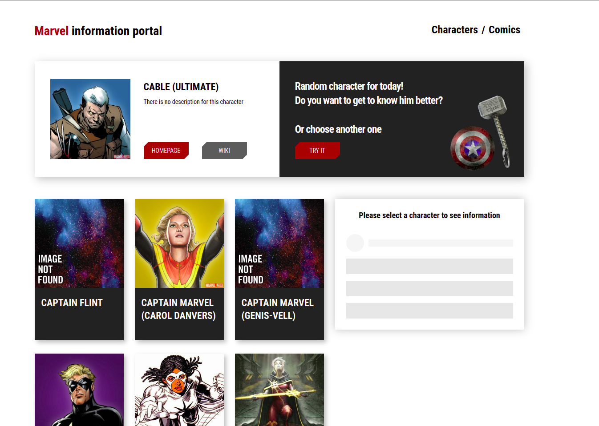

# Marvel Portal

Marvel Portal is a web application dedicated to the Marvel Universe. It provides detailed information about Marvel superheroes, villains, and other characters from Marvel comics. The app is created for Marvel fans as well as those who want to expand their knowledge of this impressive fictional universe. Currently, the project is in active development.

## Key Features

- **Extensive Character Database**: Access detailed information about hundreds of Marvel characters, including their superpowers, origin stories, appearances, and more.

- **Search and Filtering**: Quickly search for characters by name or other criteria, and filter based on various parameters such as team affiliation, universe, abilities, and more.

- **Biographies and Histories**: Immerse yourself in the captivating stories and biographies of your favorite characters, learn about their origins, allies, adversaries, and key events.

- **Image Galleries**: Browse image galleries featuring various illustrations of characters from comics, movies, and other media.

- **Links and Resources**: Access related resources such as comics, movies, games, and other media featuring Marvel characters.

This app is a true haven for Marvel fans. It provides comprehensive information about the amazing Marvel Universe, its characters, and their stories. Join Marvel Portal and discover the incredible world of Marvel!